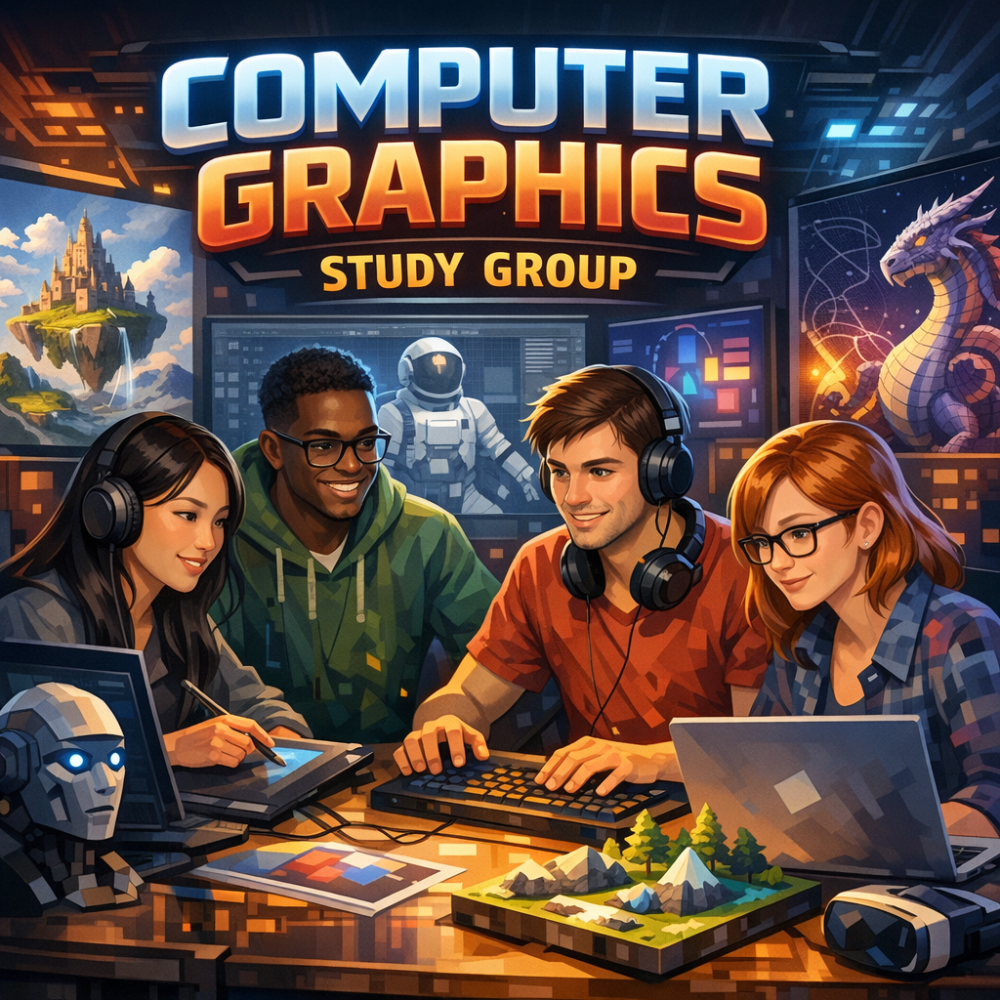

# Computer Graphics Study

    

This repository is dedicated to storing materials for a computer graphics study group. The study group operates in seasons, with each season focusing on a selected book for study.

- Season 1: ["Real-Time Rendering, Fourth Edition" by Tomas Akenine-Möller, Eric Haines, Naty Hoffman, et al.](./Season%201/)

- Season 2: "Physically Based Rendering: From Theory to Implementation, Fourth Edition" by Matt Pharr, Wenzel Jakob, and Greg Humphreys.

- Season 3: TBA
