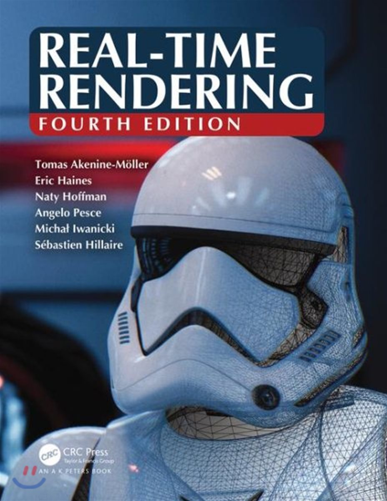

# Real-time rendering, 4th edition study

###### Presentation slides, resources and references of ["Real-time rendering, 4th Edition"](http://www.realtimerendering.com/) Book

## The Book

Thoroughly updated, this fourth edition focuses on modern techniques used to generate synthetic three-dimensional images in a fraction of a second. With the advent of programmable shaders, a wide variety of new algorithms have arisen and evolved over the past few years. This edition discusses current, practical rendering methods used in games and other applications. It also presents a solid theoretical framework and relevant mathematics for the field of interactive computer graphics, all in an approachable style.

## Presenter

TBD

## Contents (Presentation Slides - Korean)

### Chapter 1: Introduction

- Presentation Slides: Skipped.
    - Contents Overview
    - Notation and Definitions

### Chapter 2: The Graphics Rendering Pipeline

- Presentation Slides: TBA
    - Architecture
    - The Application Stage
    - Geometry Processing
    - Rasterization
    - Pixel Processing
    - Through the Pipeline

### Chapter 3: The Graphics Processing Unit

- Presentation Slides: TBA
    - Data-Parallel Architectures
    - GPU Pipeline Overview
    - The Programmable Shader Stage
    - The Evolution of Programmable Shading and APIs
    - The Vertex Shader
    - The Tessellation Stage
    - The Geometry Shader
    - The Pixel Shader
    - The Merging Stage
    - The Compute Shader

### Chapter 4: Transforms

- Presentation Slides: TBA
    - Basic Transforms
    - Special Matrix Transforms and Operations
    - Quaternions
    - Vertex Blending
    - Morphing
    - Geometry Cache Playback
    - Projections

### Chapter 5: Shading Basics

- Presentation Slides: TBA
    - Shading Models
    - Light Sources
    - Implementing Shading Models
    - Aliasing and Antialiasing
    - Transparency, Alpha, and Compositing
    - Display Encoding

### Chapter 6: Texturing

- Presentation Slides: TBA
    - The Texturing Pipeline
    - Image Texturing
    - Procedural Texturing
    - Texture Animation
    - Material Mapping
    - Alpha Mapping
    - Bump Mapping
    - Parallax Mapping
    - Textured Lights

### Chapter 7: Shadows

- Presentation Slides: TBA
    - Planar Shadows
    - Shadows on Curved Surfaces
    - Shadow Volumes
    - Shadow Maps
    - Percentage-Closer Filtering
    - Percentage-Closer Soft Shadows
    - Filtered Shadow Maps
    - Volumetric Shadow Techniques
    - Irregular Z-Buffer Shadows
    - Other Applications

### Chapter 8: Light and Color

- Presentation Slides: TBA
    - Light Quantities
    - Scene to Screen

### Chapter 9: Physically Based Shading

- Presentation Slides: TBA
    - Physics of Light
    - The Camera
    - The BRDF
    - Illumination
    - Fresnel Reflectance
    - Microgeometry
    - Microfacet Theory
    - BRDF Models for Surface Reflection
    - BRDF Models for Subsurface Scattering
    - BRDF Models for Cloth
    - Wave Optics BRDF Models
    - Layered Materials
    - Blending and Filtering Materials

### Chapter 10: Local Illumination

- Presentation Slides: TBA
    - Area Light Sources
    - Environment Lighting
    - Spherical and Hemispherical Functions
    - Environment Mapping
    - Specular Image-Based Lighting
    - Irradiance Environment Mapping
    - Sources of Error

### Chapter 11: Global Illumination

- Presentation Slides: TBA
    - The Rendering Equation
    - General Global Illumination
    - Ambient Occlusion
    - Directional Occlusion
    - Diffuse Global Illumination
    - Specular Global Illumination
    - Unified Approaches

### Chapter 12: Image-Space Effects

- Presentation Slides: TBA
    - Image Processing
    - Reprojection Techniques
    - Lens Flare and Bloom
    - Depth of Field
    - Motion Blur

### Chapter 13: Beyond Polygons

- Presentation Slides: TBA
    - The Rendering Spectrum
    - Fixed-View Effects
    - Skyboxes
    - Light Field Rendering
    - Sprites and Layers
    - Billboarding
    - Displacement Techniques
    - Particle Systems
    - Point Rendering
    - Voxels

### Chapter 14: Volumetric and Translucency Rendering

- Presentation Slides: TBA
    - Light Scattering Theory
    - Specialized Volumetric Rendering
    - General Volumetric Rendering
    - Sky Rendering
    - Translucent Surfaces
    - Subsurface Scattering
    - Hair and Fur
    - Unified Approaches

### Chapter 15: Non-Photorealistic Rendering

- Presentation Slides: TBA
    - Toon Shading
    - Outline Rendering
    - Stroke Surface Stylization
    - Lines
    - Text Rendering

### Chapter 16: Polygonal Techniques

- Presentation Slides: TBA
    - Sources of Three-Dimensional Data
    - Tessellation and Triangulation
    - Consolidation
    - Triangle Fans, Strips, and Meshes
    - Simplification
    - Compression and Precision

### Chapter 17: Curves and Curved Surfaces

- Presentation Slides: TBA
    - Parametric Curves
    - Parametric Curved Surfaces
    - Implicit Surfaces
    - Subdivision Curves
    - Subdivision Surfaces
    - Efficient Tessellation

### Chapter 18: Pipeline Optimization

- Presentation Slides: TBA
    - Profiling and Debugging Tools
    - Locating the Bottleneck
    - Performance Measurements
    - Optimization
    - Multiprocessing

### Chapter 19: Acceleration Algorithms

- Presentation Slides: TBA
    -  Spatial Data Structures
    -  Culling Techniques
    -  Backface Culling
    -  View Frustum Culling
    -  Portal Culling
    -  Detail and Small Triangle Culling
    -  Occlusion Culling
    -  Culling Systems
    -  Level of Detail
    -  Rendering Large Scenes

### Chapter 20: Efficient Shading

- Presentation Slides: TBA
    - Deferred Shading
    - Decal Rendering
    - Tiled Shading
    - Clustered Shading
    - Deferred Texturing
    - Object- and Texture-Space Shading

### Chapter 21: Virtual and Argumented Reality

- Presentation Slides: TBA
    - Equipment and Systems Overview
    - Physical Elements
    - APIs and Hardware
    - Rendering Techniques

### Chapter 22: Intersection Test Methods

- Presentation Slides: TBA
    - GPU-Accelerated Picking
    - Definitions and Tools
    - Bounding Volume Creation
    - Geometric Probability
    - Rules of Thumb
    - Ray/Sphere Intersection
    - Ray/Box Intersection
    - Ray/Triangle Intersection
    - Ray/Polygon Intersection
    - Plane/Box Intersection
    - Triangle/Triangle Intersection
    - Triangle/Box Intersection
    - Bounding-Volume/Bounding-Volume Intersection
    - View Frustum Intersection
    - Line/Line Intersection
    - Intersection between Three Planes                                          

### Chapter 23: Graphics Hardware

- Presentation Slides: TBA
    - Rasterization
    - Massive Compute and Scheduling
    - Latency and Occupancy
    - Memory Architecture and Buses
    - Caching and Compression
    - Color Buffering
    - Depth Culling, Testing, and Buffering
    - Texturing
    - Architecture
    - Case Studies
    - Ray Tracing Architectures

### Chapter 24: The Future

- Presentation Slides: Skipped.
    - Everything Else
    - You

### [Chapter 25: Collision Detection](http://www.realtimerendering.com/Real-Time_Rendering_4th-Collision_Detection.pdf)

- Presentation Slides: TBA
    - Broad Phase Collision Detection
    - Mid Phase Collision Detection
    - Narrow Phase Collision Detection
    - Collision Detection with Rays
    - Dynamic CD Using BSP Trees
    - Time-Critical Collision Detection
    - Deformable Models
    - Continuous Collision Detection
    - Collision Response
    - Particles
    - Broad Phase Collision Detection                                        

### [Chapter 26: Real-Time Ray Tracing](http://www.realtimerendering.com/Real-Time_Rendering_4th-Real-Time_Ray_Tracing.pdf)

- Presentation Slides: TBA
    - Broad Phase Collision Detection
    - Shaders for Ray Tracing
    - Top and Bottom Level Acceleration Structures
    - Coherency
    - Denoising
    - Texture Filtering
    - Speculations

### [Linear Algebra](http://www.realtimerendering.com/Real-Time_Rendering_4th-Appendices.pdf)

- Presentation Slides: TBA
    - Euclidean Space
    - Geometrical Interpretation
    - Matrices
    - Homogeneous Notation
    - Geometry         

### [Trigonometry](http://www.realtimerendering.com/Real-Time_Rendering_4th-Appendices.pdf)

- Presentation Slides: TBA
    - Definitions
    - Trigonometric Laws and Formulae

## License

The class is licensed under the [MIT License](http://opensource.org/licenses/MIT):

Copyright &copy; 2018 [Chris Ohk](http://www.github.com/utilForever), [HyunJun Park](https://github.com/hyunjun529), [Johnson Kang](https://github.com/jwkapple), [Kyowon Yang](https://github.com/HoRangDev), [Macht Sung](https://github.com/GreenGits) and [MinHyeok Jeon](https://github.com/integraldx)

Permission is hereby granted, free of charge, to any person obtaining a copy of this software and associated documentation files (the "Software"), to deal in the Software without restriction, including without limitation the rights to use, copy, modify, merge, publish, distribute, sublicense, and/or sell copies of the Software, and to permit persons to whom the Software is furnished to do so, subject to the following conditions:

The above copyright notice and this permission notice shall be included in all copies or substantial portions of the Software.

THE SOFTWARE IS PROVIDED "AS IS", WITHOUT WARRANTY OF ANY KIND, EXPRESS OR IMPLIED, INCLUDING BUT NOT LIMITED TO THE WARRANTIES OF MERCHANTABILITY, FITNESS FOR A PARTICULAR PURPOSE AND NONINFRINGEMENT. IN NO EVENT SHALL THE AUTHORS OR COPYRIGHT HOLDERS BE LIABLE FOR ANY CLAIM, DAMAGES OR OTHER LIABILITY, WHETHER IN AN ACTION OF CONTRACT, TORT OR OTHERWISE, ARISING FROM, OUT OF OR IN CONNECTION WITH THE SOFTWARE OR THE USE OR OTHER DEALINGS IN THE SOFTWARE.