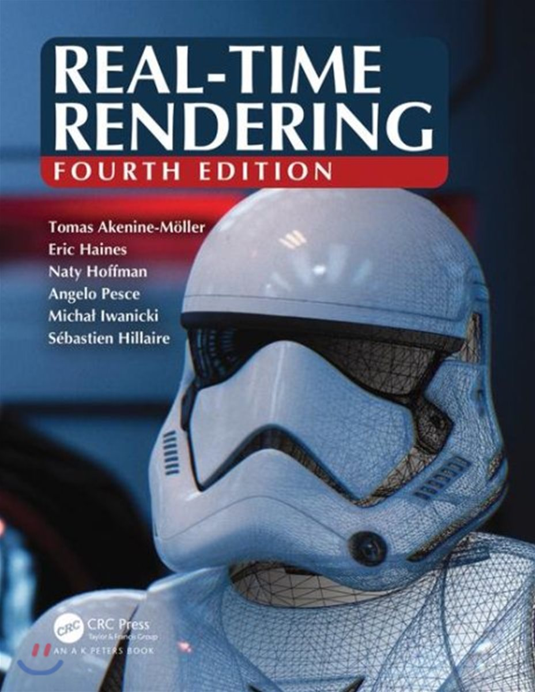

# Real-time rendering, 4th edition study

###### Presentation slides, resources and references of ["Real-time rendering, 4th Edition"](http://www.realtimerendering.com/) Book

## The Book

Thoroughly updated, this fourth edition focuses on modern techniques used to generate synthetic three-dimensional images in a fraction of a second. With the advent of programmable shaders, a wide variety of new algorithms have arisen and evolved over the past few years. This edition discusses current, practical rendering methods used in games and other applications. It also presents a solid theoretical framework and relevant mathematics for the field of interactive computer graphics, all in an approachable style.

## Presenter

- Chris Ohk
- Andrew Moon
- Donghyeon Yeo
- Haeul Kim
- Hyeok Kwon
- Jonghwan Seo
- Janghyun Choi
- Sijun Seong
- Taewoo Lee
- Wongyu Ko
- Yuhan Park

## Contents (Presentation Slides - Korean)

### Chapter 1: Introduction

- Presentation Slides: Skipped.
  - Contents Overview
  - Notation and Definitions

### Chapter 2: The Graphics Rendering Pipeline

- Presenter: Sijun Seong [[Presentation]](./1%20-%20Presentation/251122%20-%20Real-time%20Rendering%204th%20Study,%20Chapter%202,%203.pdf)
  - Architecture
  - The Application Stage
  - Geometry Processing
  - Rasterization
  - Pixel Processing
  - Through the Pipeline

### Chapter 3: The Graphics Processing Unit

- Presenter: Sijun Seong [[Presentation]](./1%20-%20Presentation/251122%20-%20Real-time%20Rendering%204th%20Study,%20Chapter%202,%203.pdf)
  - Data-Parallel Architectures
  - GPU Pipeline Overview
  - The Programmable Shader Stage
  - The Evolution of Programmable Shading and APIs
  - The Vertex Shader
  - The Tessellation Stage
  - The Geometry Shader
  - The Pixel Shader
  - The Merging Stage
  - The Compute Shader

### Chapter 4: Transforms

- Presenter: Chris Ohk [[Presentation]](./1%20-%20Presentation/251220%20-%20Real-time%20Rendering%204th%20Study,%20Chapter%204.pdf)
  - Basic Transforms
  - Special Matrix Transforms and Operations
  - Quaternions
  - Vertex Blending
  - Morphing
  - Geometry Cache Playback
  - Projections

### Chapter 5: Shading Basics

- Presenter: Hyeok Kwon [[Presentation]](./1%20-%20Presentation/260122%20-%20Real-time%20Rendering%204th%20Study,%20Chapter%205.pdf)
  - Shading Models
  - Light Sources
  - Implementing Shading Models
  - Aliasing and Antialiasing
  - Transparency, Alpha, and Compositing
  - Display Encoding

### Chapter 6: Texturing

- Presenter: Janghyun Choi [[Presentation]](./1%20-%20Presentation/260228%20-%20Real-time%20Rendering%204th%20Study,%20Chapter%206.pdf)
  - The Texturing Pipeline
  - Image Texturing
  - Procedural Texturing
  - Texture Animation
  - Material Mapping
  - Alpha Mapping
  - Bump Mapping
  - Parallax Mapping
  - Textured Lights

### Chapter 7: Shadows

- Presenter: Haeul Kim [[Presentation]](./1%20-%20Presentation/260314%20-%20Real-time%20Rendering%204th%20Study,%20Chapter%207.pdf)
  - Planar Shadows
  - Shadows on Curved Surfaces
  - Shadow Volumes
  - Shadow Maps
  - Percentage-Closer Filtering
  - Percentage-Closer Soft Shadows
  - Filtered Shadow Maps
  - Volumetric Shadow Techniques
  - Irregular Z-Buffer Shadows
  - Other Applications

### Chapter 8: Light and Color

- Presenter: Donghyeon Yeo [[Presentation]](./1%20-%20Presentation/260314%20-%20Real-time%20Rendering%204th%20Study,%20Chapter%208.pdf)
  - Light Quantities
  - Scene to Screen

### Chapter 9: Physically Based Shading

- Presenter: Chris Ohk
  - Physics of Light
  - The Camera
  - The BRDF
  - Illumination
  - Fresnel Reflectance
  - Microgeometry
  - Microfacet Theory
  - BRDF Models for Surface Reflection
  - BRDF Models for Subsurface Scattering
  - BRDF Models for Cloth
  - Wave Optics BRDF Models
  - Layered Materials
  - Blending and Filtering Materials

### Chapter 10: Local Illumination

- Presenter: Sijun Seong [[Presentation]](./1%20-%20Presentation/260725%20-%20Real-time%20Rendering%204th%20Study,%20Chapter%2010.pdf)
  - Area Light Sources
  - Environment Lighting
  - Spherical and Hemispherical Functions
  - Environment Mapping
  - Specular Image-Based Lighting
  - Irradiance Environment Mapping
  - Sources of Error

### Chapter 11: Global Illumination

- Presenter: Yuhan Park [[Presentation]](./1%20-%20Presentation/260822%20-%20Real-time%20Rendering%204th%20Study,%20Chapter%2011.pdf)
  - The Rendering Equation
  - General Global Illumination
  - Ambient Occlusion
  - Directional Occlusion
  - Diffuse Global Illumination
  - Specular Global Illumination
  - Unified Approaches

### Chapter 12: Image-Space Effects

- Presenter: TBA
  - Image Processing
  - Reprojection Techniques
  - Lens Flare and Bloom
  - Depth of Field
  - Motion Blur

### Chapter 13: Beyond Polygons

- Presenter: TBA
  - The Rendering Spectrum
  - Fixed-View Effects
  - Skyboxes
  - Light Field Rendering
  - Sprites and Layers
  - Billboarding
  - Displacement Techniques
  - Particle Systems
  - Point Rendering
  - Voxels

### Chapter 14: Volumetric and Translucency Rendering

- Presenter: TBA
  - Light Scattering Theory
  - Specialized Volumetric Rendering
  - General Volumetric Rendering
  - Sky Rendering
  - Translucent Surfaces
  - Subsurface Scattering
  - Hair and Fur
  - Unified Approaches

### Chapter 15: Non-Photorealistic Rendering

- Presenter: TBA
  - Toon Shading
  - Outline Rendering
  - Stroke Surface Stylization
  - Lines
  - Text Rendering

### Chapter 16: Polygonal Techniques

- Presenter: TBA
  - Sources of Three-Dimensional Data
  - Tessellation and Triangulation
  - Consolidation
  - Triangle Fans, Strips, and Meshes
  - Simplification
  - Compression and Precision

### Chapter 17: Curves and Curved Surfaces

- Presenter: TBA
  - Parametric Curves
  - Parametric Curved Surfaces
  - Implicit Surfaces
  - Subdivision Curves
  - Subdivision Surfaces
  - Efficient Tessellation

### Chapter 18: Pipeline Optimization

- Presenter: TBA
  - Profiling and Debugging Tools
  - Locating the Bottleneck
  - Performance Measurements
  - Optimization
  - Multiprocessing

### Chapter 19: Acceleration Algorithms

- Presenter: TBA
  - Spatial Data Structures
  - Culling Techniques
  - Backface Culling
  - View Frustum Culling
  - Portal Culling
  - Detail and Small Triangle Culling
  - Occlusion Culling
  - Culling Systems
  - Level of Detail
  - Rendering Large Scenes

### Chapter 20: Efficient Shading

- Presenter: TBA
  - Deferred Shading
  - Decal Rendering
  - Tiled Shading
  - Clustered Shading
  - Deferred Texturing
  - Object- and Texture-Space Shading

### Chapter 21: Virtual and Argumented Reality

- Presenter: TBA
  - Equipment and Systems Overview
  - Physical Elements
  - APIs and Hardware
  - Rendering Techniques

### Chapter 22: Intersection Test Methods

- Presenter: TBA
  - GPU-Accelerated Picking
  - Definitions and Tools
  - Bounding Volume Creation
  - Geometric Probability
  - Rules of Thumb
  - Ray/Sphere Intersection
  - Ray/Box Intersection
  - Ray/Triangle Intersection
  - Ray/Polygon Intersection
  - Plane/Box Intersection
  - Triangle/Triangle Intersection
  - Triangle/Box Intersection
  - Bounding-Volume/Bounding-Volume Intersection
  - View Frustum Intersection
  - Line/Line Intersection
  - Intersection between Three Planes

### Chapter 23: Graphics Hardware

- Presenter: TBA
  - Rasterization
  - Massive Compute and Scheduling
  - Latency and Occupancy
  - Memory Architecture and Buses
  - Caching and Compression
  - Color Buffering
  - Depth Culling, Testing, and Buffering
  - Texturing
  - Architecture
  - Case Studies
  - Ray Tracing Architectures

### Chapter 24: The Future

- Presentation Slides: Skipped.
  - Everything Else
  - You

### [Chapter 25: Collision Detection](http://www.realtimerendering.com/Real-Time_Rendering_4th-Collision_Detection.pdf)

- Presenter: TBA
  - Broad Phase Collision Detection
  - Mid Phase Collision Detection
  - Narrow Phase Collision Detection
  - Collision Detection with Rays
  - Dynamic CD Using BSP Trees
  - Time-Critical Collision Detection
  - Deformable Models
  - Continuous Collision Detection
  - Collision Response
  - Particles
  - Broad Phase Collision Detection

### [Chapter 26: Real-Time Ray Tracing](http://www.realtimerendering.com/Real-Time_Rendering_4th-Real-Time_Ray_Tracing.pdf)

- Presenter: TBA
  - Broad Phase Collision Detection
  - Shaders for Ray Tracing
  - Top and Bottom Level Acceleration Structures
  - Coherency
  - Denoising
  - Texture Filtering
  - Speculations

### [Linear Algebra](http://www.realtimerendering.com/Real-Time_Rendering_4th-Appendices.pdf)

- Presenter: TBA
  - Euclidean Space
  - Geometrical Interpretation
  - Matrices
  - Homogeneous Notation
  - Geometry

### [Trigonometry](http://www.realtimerendering.com/Real-Time_Rendering_4th-Appendices.pdf)

- Presenter: TBA
  - Definitions
  - Trigonometric Laws and Formulae
